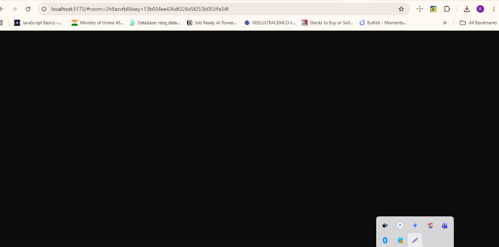

<div align="center">
  <h1>🎨 SleekDraw</h1>
  <p><strong>A virtual hand-drawn style collaborative whiteboard. E2EE and responsive.</strong></p>
</div>

<h4 align="center">
  <a href="#-features">Features</a> |
  <a href="#%EF%B8%8F-tech-stack">Tech Stack</a> |
  <a href="#-local-development">Local Development</a> |
  <a href="#%EF%B8%8F-vps-docker-deployment">Docker Setup</a>
</h4>

<br />

<p align="center">
  <a href="./LICENSE">
    
  </a>
  
  
  
  
</p>

<div align="center">
  <figure>
    
    <figcaption>
      <p align="center">
        Create beautiful hand-drawn styled mockups, arrows, rectangles, freehand drawings, and diagrams.
      </p>
    </figcaption>
  </figure>
</div>

---

## ✨ Features

SleekDraw is packed with tools for creators, designers, and teams:

- 🎨 **Hand-Drawn Aesthetics:** Uses Rough.js to draw beautiful, sketchy shapes, lines, arrows, rectangles, ellipses, and pencil paths.
- 🔒 **End-to-End Encrypted (E2EE) Collaboration:** Real-time whiteboard room syncing over Socket.io. Canvas data is encrypted directly in the client using Web Crypto APIs. The server only relays encrypted blobs—the key resides exclusively in the URL hash and never touches the server.
- 🚀 **High-Performance Culling:** Runs coordinate-bounding culling bounds checks. Caching the elements bounds shifts drawing culling and outlines computation from $O(N)$ to $O(1)$, keeping canvas rendering smooth.
- 🗃️ **Excalidraw Shape Library Integration:** Seamlessly browse the entire community Excalidraw libraries catalog from GitHub, download shape collections, and insert/auto-scale template components directly onto your canvas.
- 🔄 **Local Undo/Redo Stack:** Full canvas state history management with robust undo and redo buffers.
- 🔍 **Cursor-Centered Panning Zoom:** Grab canvas Panning using `Spacebar` + mouse drag, and zoom in/out relative to your cursor using `Ctrl + Mouse Wheel Scroll`.
- 📁 **Vector Graphics Exporters:** Export drawings natively to clean vector SVGs or high-definition PNGs.
- 🌓 **Glassmorphic UI Themes:** Dark and Light interface layouts featuring Harmonious HSL colors.

---

## 🛠️ Tech Stack

* **Frontend:** React 19, TypeScript, Vite, TailwindCSS (for CSS styling layouts), Rough.js (hand-drawn rendering)
* **Icons & Fonts:** Lucide React, Outfit (Google Font)
* **Backend:** Node.js, Express, Socket.io (real-time communication)
* **Encryption:** Web Crypto API (AES-GCM encryption)

---

## 💻 Local Development

### 1. Prerequisite
Ensure you have [Node.js](https://nodejs.org) installed.

### 2. Frontend Development
Run the React + Vite dev server locally:
```bash
# Install root dependencies
npm install

# Run Vite dev server
npm run dev
```

### 3. Backend Development
Run the Socket.io relay server locally:
```bash
# Navigate to server directory
cd server

# Install dependencies
npm install

# Run the relay server
npm start
```
The server will boot on `http://localhost:4000`.

---

## 🐳 VPS Docker Deployment

The project includes a ready-to-use Docker configuration to deploy the Socket.io relay backend on your VPS.

### Launch via Docker Compose
Build and run the backend container in detached mode on port `4000`:
```bash
docker compose up -d --build
```

### Docker Services structure:
- **`backend`:** Runs Node.js alpine container.
- **Port mapping:** `4000:4000`

---

## 🚀 CI/CD & Deployments

- **Frontend:** Automatically deployed to **Vercel** via `.github/workflows/vercel-deploy.yml` upon pushes to the `main` branch.
- **Backend:** Hosted on your VPS, running as a Dockerized node server.
